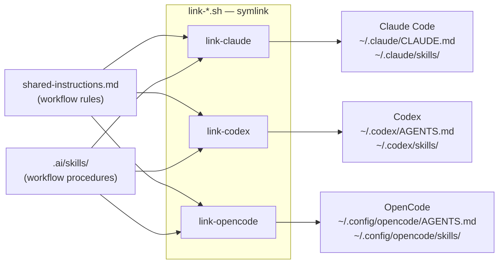
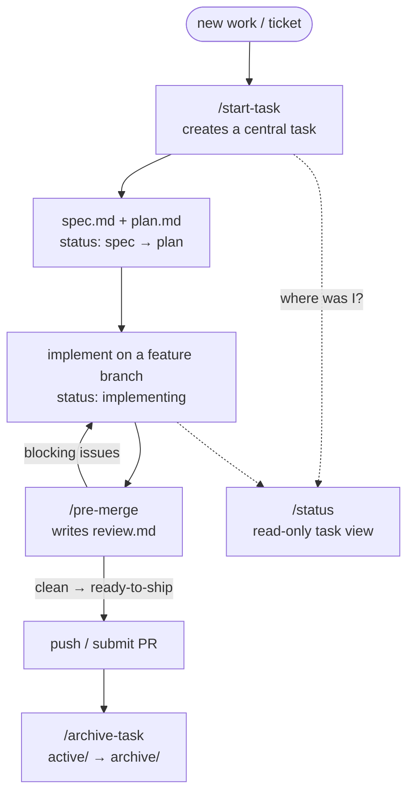

# dot-files

> Shared configuration for shell, Neovim, Claude Code, Codex, and OpenCode — symlinked into `$HOME` so everything stays version-controlled.

---

## Quick start

New machine, or new to this workflow? [`docs/SETUP.md`](docs/SETUP.md) walks through git, GitHub, stacked PRs, and running agents on remote sandboxes.

```bash
git clone <repo-url> ~/Develop/dot-files
~/Develop/dot-files/link.sh          # everything
```

Each piece installs on its own if you'd rather not touch your shell or editor:

| Install | Remove | What it touches |
| --- | --- | --- |
| `link.sh` | `unlink.sh` | Everything below |
| `link-claude.sh` | `unlink-claude.sh` | `~/.claude/` |
| `link-codex.sh` | `unlink-codex.sh` | `~/.codex/` |
| `link-opencode.sh` | `unlink-opencode.sh` | `~/.config/opencode/` |
| `link-agent-memory.sh` | `unlink-agent-memory.sh` | `~/.local/bin/agent-memory` |
| `link-agent-run.sh` | `unlink-agent-run.sh` | `~/.local/bin/agent-run` |

Check an install with `./doctor.sh` (read-only, exits non-zero on the first dangling link) or `./list-symlink.sh`.

---

## The AI workflow layer

### One source, every agent

Workflow content is written **once** under `.ai/` and projected into each tool's native location by the `link-*.sh` scripts. They all read through symlinks to the same files, so editing `.ai/` updates every agent at once.


```mermaid
flowchart LR
    rules["shared-instructions.md<br/>(workflow rules)"]
    skills[".ai/skills/<br/>(workflow procedures)"]

    subgraph links["link-*.sh — symlink"]
        lc["link-claude"]
        lx["link-codex"]
        lo["link-opencode"]
    end

    rules --> lc & lx & lo
    skills --> lc & lx & lo

    lc --> claude["Claude Code<br/>~/.claude/CLAUDE.md<br/>~/.claude/skills/"]
    lx --> codex["Codex<br/>~/.codex/AGENTS.md<br/>~/.codex/skills/"]
    lo --> opencode["OpenCode<br/>~/.config/opencode/AGENTS.md<br/>~/.config/opencode/skills/"]
```

Claude surfaces the skills as slash commands (`/start-task`); Codex and OpenCode load them as skills of the same name. The content is identical everywhere.

### The task workflow

Work is organised as **tasks**, not branches. A task lives outside every checkout at `$AGENT_LOCAL_MEMORY_PATH`, can bind more than one repository, and carries its own status — the `status:` field in `notes.md` frontmatter is the source of truth for where it stands.


```mermaid
flowchart TD
    new([new work / ticket]) --> st["/start-task<br/>creates a central task"]
    st --> spec["spec.md + plan.md<br/>status: spec → plan"]
    spec --> impl["implement on a feature branch<br/>status: implementing"]
    impl --> pm["/pre-merge<br/>writes review.md"]
    pm -->|blocking issues| impl
    pm -->|clean → ready-to-ship| ship["push / submit PR"]
    ship --> arch["/archive-task<br/>active/ → archive/"]
    st -.->|"where was I?"| status["/status<br/>read-only task view"]
    impl -.-> status
```

The everyday loop: `/start-task` → design `spec.md` together → draft the plan in the tool's native plan mode → implement → `/pre-merge` when tests pass → submit → `/archive-task`.

### Skills

| Skill | What it does |
| --- | --- |
| `start-task` | On-ramp for new work. Creates a central task with its working files, binds repositories, and ingests a ticket link from any tracker. |
| `status` | Read-only view of every active task with status, size, and next-step suggestion. |
| `pre-merge` | Production-safety gate: adversarial review plus a hardening checklist against spec, plan, system map, and the diff. |
| `archive-task` | Lifecycle close-out. Moves `active/<slug>/` → `archive/<slug>/` and graduates durable knowledge into the repository. |
| `orchestrate` | Coordinates a ticket, epic, or milestone across tracker state, tasks, repositories, branches, and pull requests. |
| `minion-language` | Speaks Minionese. |

### Enforcement

This layer instructs agents; it does not enforce against them, and it carries no branch policy of its own. Which branches may be written to belongs to each repository — its `AGENTS.md`/`CLAUDE.md`, branch protection, required reviews, CI — where the policy covers every contributor rather than only the machines running these dotfiles. The shared rules cover how to work a stack, not what a repository permits.

### Going deeper

| Read | For |
| --- | --- |
| [`.ai/shared-instructions.md`](.ai/shared-instructions.md) | The operating rules themselves, and what each task file is for |
| [`.ai/HARNESS.md`](.ai/HARNESS.md) | The machinery behind them — layer map, memory root layout, current-task resolution order, recovery |
| [`.ai/skills/`](.ai/skills/) | Each procedure in full |
| [`agent-run/README.md`](agent-run/README.md) | Running coding agents on disposable remote sandboxes |
| [`docs/SETUP.md`](docs/SETUP.md) | A machine from nothing: git, GitHub, stacked PRs, remote agents |
| `agent-memory --help` | The CLI surface, including legacy-store migration |

---

## Neovim

Simplified Neovim 0.11 config with [lazy.nvim](https://github.com/folke/lazy.nvim). Optimized for TypeScript/JavaScript web development.

|                |                                                                                         |
| -------------- | --------------------------------------------------------------------------------------- |
| **LSP**        | ts_ls, eslint, html, cssls, jsonls, yamlls, dockerls, lua_ls (auto-installed via Mason) |
| **Completion** | Neovim 0.11 native LSP completion                                                      |
| **Navigation** | Telescope (fuzzy finder) + Harpoon 2 (file marks)                                       |
| **Git**        | Gitsigns + Diffview (diffs) + git-conflict (merge resolution)                           |
| **AI**         | claudecode.nvim + opencode.nvim (AI CLI integrations)                                   |
| **Buffers**    | Bufferline (buffer tabs with pin/close support)                                         |
| **Formatting** | conform.nvim (oxfmt > prettier for JS/TS, stylua for Lua)                               |
| **Theme**      | Kanagawa (wave)                                                                         |
| **Leader**     | `Space`                                                                                 |

Full keybindings in [`.config/nvim/KEYBINDINGS.md`](.config/nvim/KEYBINDINGS.md).

## tmux

Stock tmux with comfort settings only — every default key binding is left alone,
so what you learn transfers to any machine, including the remote VMs `agent-run`
uses. Mouse on, 50k lines of scrollback, Kanagawa status bar to match Neovim.

Keys and a troubleshooting table in [`.config/tmux/CHEATSHEET.md`](.config/tmux/CHEATSHEET.md).

## Shell

Zsh with [oh-my-zsh](https://ohmyz.sh/) + [powerlevel10k](https://github.com/romkatv/powerlevel10k) prompt. Includes git and [asdf](https://asdf-vm.com/) plugins, [fzf](https://github.com/junegunn/fzf) integration, Go path setup, and bun completions.

## Prerequisites

| Tool | Required for |
| --- | --- |
| [Neovim](https://neovim.io/) >= 0.11 | Editor config |
| [oh-my-zsh](https://ohmyz.sh/) | Shell config |
| [powerlevel10k](https://github.com/romkatv/powerlevel10k) | Shell theme |
| [asdf](https://asdf-vm.com/) | Version management |
| [fzf](https://github.com/junegunn/fzf) | Fuzzy finding |
| [tmux](https://github.com/tmux/tmux) | Terminal multiplexing, `agent-run monitor` |
| [GitHub CLI](https://cli.github.com/) + `gh stack` | Shared workflow rules |
| [Python](https://www.python.org/) >= 3.10 | `agent-memory` runtime |
| [Claude Code](https://docs.anthropic.com/en/docs/claude-code) | Claude integration |
| [Codex](https://developers.openai.com/codex/) | Codex integration |
