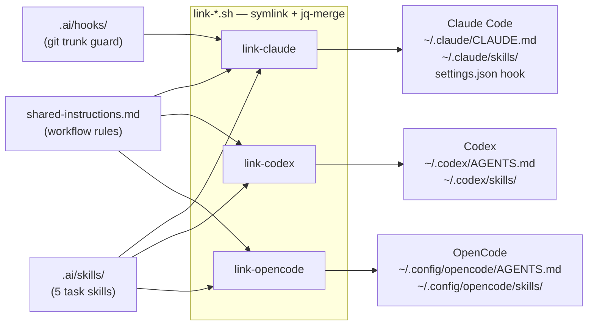
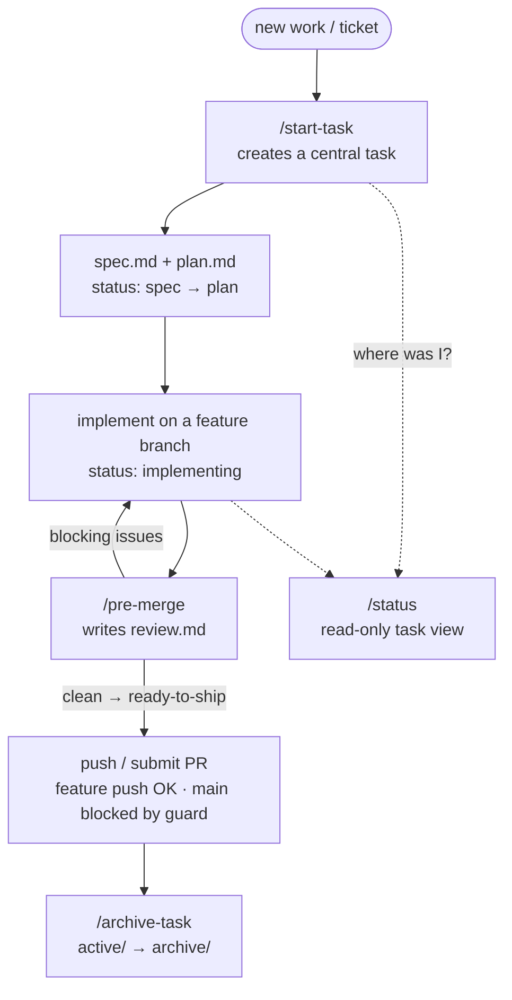

# dot-files

> Shared configuration for shell, Neovim, Claude Code, Codex, and OpenCode — symlinked into `$HOME` so everything stays version-controlled.

---

## Quick start

**Full setup** (shell + editor + AI tooling):

```bash
git clone <repo-url> ~/Develop/dot-files
~/Develop/dot-files/link.sh
```

**Claude Code only** (won't touch your shell or editor):

```bash
git clone <repo-url> ~/Develop/dot-files
~/Develop/dot-files/link-claude.sh
```

**Codex only** (won't touch your shell or editor):

```bash
git clone <repo-url> ~/Develop/dot-files
~/Develop/dot-files/link-codex.sh
```

> To undo, run `unlink.sh`, `unlink-claude.sh`, or `unlink-codex.sh` respectively.

---

## How it works

### One source, every agent

The workflow content is written **once** under `.ai/` and projected into each tool's native location by the `link-*.sh` scripts. Editing `.ai/` updates every agent at once (they read through symlinks); only the Claude-only guard hook differs per tool.


```mermaid
flowchart LR
    rules["shared-instructions.md<br/>(workflow rules)"]
    skills[".ai/skills/<br/>(5 task skills)"]
    hooks[".ai/hooks/<br/>(git trunk guard)"]

    subgraph links["link-*.sh — symlink + jq-merge"]
        lc["link-claude"]
        lx["link-codex"]
        lo["link-opencode"]
    end

    rules --> lc & lx & lo
    skills --> lc & lx & lo
    hooks --> lc

    lc --> claude["Claude Code<br/>~/.claude/CLAUDE.md<br/>~/.claude/skills/<br/>settings.json hook"]
    lx --> codex["Codex<br/>~/.codex/AGENTS.md<br/>~/.codex/skills/"]
    lo --> opencode["OpenCode<br/>~/.config/opencode/AGENTS.md<br/>~/.config/opencode/skills/"]
```

### The task workflow

The skills drive a small lifecycle on top of centralized task memory at `$AGENT_LOCAL_MEMORY_PATH`. Tasks are source-agnostic, can bind to more than one repository, and use `notes.md` frontmatter as the lifecycle source of truth. The trunk guard makes the "never touch `main`" rule deterministic.


```mermaid
flowchart TD
    new([new work / ticket]) --> st["/start-task<br/>creates a central task"]
    st --> spec["spec.md + plan.md<br/>status: spec → plan"]
    spec --> impl["implement on a feature branch<br/>status: implementing"]
    impl --> pm["/pre-merge<br/>writes review.md"]
    pm -->|blocking issues| impl
    pm -->|clean → ready-to-ship| ship["push / submit PR<br/>feature push OK · main blocked by guard"]
    ship --> arch["/archive-task<br/>active/ → archive/"]
    st -.->|"where was I?"| status["/status<br/>read-only task view"]
    impl -.-> status
```

---

## What's inside

### Claude Code

Claude uses the shared workflow rules from [`.ai/shared-instructions.md`](.ai/shared-instructions.md), symlinked into Claude's native `~/.claude/CLAUDE.md` location by `link-claude.sh`.

**Shared rules** enforce:

- Branch management with **GitHub native stacked PRs** (`gh stack`) — with plain-`git` fallbacks where stacking isn't available
- **Git worktrees** inside the repo (`.worktrees/`, gitignored) for parallel work
- Auto-decomposition of features into **stacked PRs**
- **Conventional commits** and **scoped testing** (only runs tests for changed files)
- Central, multi-repository task memory at `$AGENT_LOCAL_MEMORY_PATH` — see "AI-Native Engineering Workflow" below

**Shared repo workflow skills** live in [`.ai/skills/`](.ai/skills/) and are symlinked into Claude's native skills folder by `link-claude.sh`.

**Skills:** Claude surfaces the shared workflow skills as slash commands — `/start-task`, `/status`, `/pre-merge`, `/archive-task`. See the [shared skills table](#shared-source).

### Codex

Codex uses the same shared workflow rules from [`.ai/shared-instructions.md`](.ai/shared-instructions.md), symlinked into Codex's native `~/.codex/AGENTS.md` location by `link-codex.sh`.

**Shared repo workflow skills** live once in [`.ai/skills/`](.ai/skills/) and are symlinked into `~/.codex/skills/` by `link-codex.sh`. Codex loads the same workflows (see the [shared skills table](#shared-source)).

### OpenCode

OpenCode uses the same shared workflow rules from [`.ai/shared-instructions.md`](.ai/shared-instructions.md), symlinked into OpenCode's native `~/.config/opencode/AGENTS.md` location by `link-opencode.sh`.

**Shared repo workflow skills** live once in [`.ai/skills/`](.ai/skills/) and are symlinked into `~/.config/opencode/skills/` by `link-opencode.sh`.

### Shared Source

The reusable workflow content is agent-agnostic and lives in:

- [`.ai/shared-instructions.md`](.ai/shared-instructions.md) for durable global workflow rules
- [`.ai/skills/`](.ai/skills/) for reusable task workflows

The shared skills (slash commands in Claude — `/start-task` etc.; skills of the same name in Codex and OpenCode):

| Skill          | What it does                                                                                                       |
| -------------- | ----------------------------------------------------------------------------------------------------------------- |
| `start-task`   | On-ramp for new work. Creates a central task with metadata and five working files, binds repositories, and ingests a ticket link from any tracker. |
| `status`       | Read-only view of every active task with status, size, and next-step suggestion.                                  |
| `pre-merge`    | Production-safety gate: adversarial review + hardening checklist against spec, plan, system-map, and the diff.     |
| `archive-task` | Lifecycle close-out. Moves `active/<slug>/` → `archive/<slug>/`, optionally graduates docs to the repo.           |
| `orchestrate`  | Coordinates a ticket, epic, or milestone across tracker state, tasks, repositories, branches, and pull requests. |

The link scripts project those shared files into each tool's native structure:

- Claude Code -> `~/.claude/CLAUDE.md` and `~/.claude/skills/`
- Codex -> `~/.codex/AGENTS.md` and `~/.codex/skills/`
- OpenCode -> `~/.config/opencode/AGENTS.md` and `~/.config/opencode/skills/`

The shared rules and `.ai/skills/` are identical everywhere.

### Enforcement

`link-claude.sh` also registers a `PreToolUse` hook ([`.ai/hooks/guard-git-trunk.sh`](.ai/hooks/guard-git-trunk.sh)) that deterministically blocks committing to or pushing `main`/`master`/`trunk`. Advisory rules in `shared-instructions.md` can be drifted past mid-session; the hook cannot. It is Claude-specific and merged idempotently into `~/.claude/settings.json` (a backup is kept); `unlink-claude.sh` removes only that entry.

---

### AI-Native Engineering Workflow

These shared skills plus the shared instructions file form a small, self-contained workflow layer on each tool's native primitives. In Claude, the user-facing surface is three commands (`/start-task`, `/pre-merge`, `/archive-task`) plus `/status`; in Codex, the same workflows are available as skills.

**Per-task working memory** under `$AGENT_LOCAL_MEMORY_PATH/tasks/active/<task-id>/`:

- `task.json` — stable task identity, tracker reference, and one or more repository bindings with optional roles
- `spec.md` — the what and why (goal, scope, success criteria), agreed with the human before planning. When a ticket exists (Linear, GitHub Issues, or any tracker), the ticket owns the problem statement: the spec links to it, summarizes it once (with fetch date), and records only the delta — scope, success criteria, chosen approach.
- `plan.md` — the how, drafted in the tool's native plan mode (Claude Plan Mode, Codex plan mode, OpenCode's plan agent) and saved here once approved
- `notes.md` — front-matter (slug, ticket, size, status, last-updated) + running log
- `review.md` — written by `/pre-merge`

**Durable architectural intelligence** is namespaced by normalized repository identity under `$AGENT_LOCAL_MEMORY_PATH/repositories/` (prefixed filenames: `inv-`, `area-`, `danger-`, `pitfall-`). It grows as tasks archive without mixing knowledge between repositories.

**Typical flow:**

1. `/start-task` (slug + auto-detected size) →
2. describe intent — design the spec together, then draft the plan in the tool's plan mode →
3. `/pre-merge` when tests pass →
4. submit + merge →
5. `/archive-task` (auto-suggested when PR is merged).

Set `AGENT_LOCAL_MEMORY_PATH` to override the default `${XDG_DATA_HOME:-$HOME/.local/share}/agent-memory`. `agent-memory root`, `agent-memory list`, and `agent-memory current` make resolution explicit. Legacy stores can be inventoried safely with `agent-memory migrate --source <repo>`, then migrated with `--apply`; migration is additive, verifies staged data before promotion, and never deletes its sources. Incomplete legacy tasks block by default and can only be imported with explicit `--materialize-missing` placeholders after reviewing the dry run.

If a machine crash leaves `.migration.lock` behind, first confirm no migration
process is running, then remove only that lock directory from the resolved
memory root and rerun the same command. A normal failure cleans up its own lock.

---

### Neovim

Simplified Neovim 0.11 config with [lazy.nvim](https://github.com/folke/lazy.nvim). Optimized for TypeScript/JavaScript web development.

|                |                                                                                         |
| -------------- | --------------------------------------------------------------------------------------- |
| **LSP**        | ts_ls, eslint, html, cssls, jsonls, yamlls, dockerls, lua_ls (auto-installed via Mason) |
| **Completion** | Neovim 0.11 native LSP completion                                                      |
| **Navigation** | Telescope (fuzzy finder) + Harpoon 2 (file marks)                                       |
| **Git**        | Gitsigns + Diffview (diffs) + git-conflict (merge resolution)                           |
| **AI**         | claudecode.nvim + opencode.nvim (AI CLI integrations)                                   |
| **Buffers**    | Bufferline (buffer tabs with pin/close support)                                         |
| **Formatting** | conform.nvim (oxfmt > prettier for JS/TS, stylua for Lua)                               |
| **Theme**      | Kanagawa (wave)                                                                         |
| **Leader**     | `Space`                                                                                 |

Full keybindings in [`.config/nvim/KEYBINDINGS.md`](.config/nvim/KEYBINDINGS.md).

---

### Shell

Zsh with [oh-my-zsh](https://ohmyz.sh/) + [powerlevel10k](https://github.com/romkatv/powerlevel10k) prompt. Includes git and [asdf](https://asdf-vm.com/) plugins, [fzf](https://github.com/junegunn/fzf) integration, Go path setup, and bun completions.

---

## Scripts

| Script             | Purpose                                        |
| ------------------ | ---------------------------------------------- |
| `link.sh`          | Symlink everything into `$HOME`                |
| `unlink.sh`        | Remove all symlinks managed by this repo       |
| `link-claude.sh`   | Symlink only Claude Code config                |
| `unlink-claude.sh` | Remove only Claude Code symlinks               |
| `link-codex.sh`    | Symlink only Codex config                      |
| `unlink-codex.sh`  | Remove only Codex symlinks                     |
| `link-opencode.sh` | Symlink only OpenCode config                   |
| `unlink-opencode.sh` | Remove only OpenCode symlinks                |
| `link-agent-memory.sh` | Install the shared `agent-memory` command   |
| `unlink-agent-memory.sh` | Remove the shared command symlink         |
| `list-symlink.sh`  | List all active symlinks pointing to this repo |
| `doctor.sh`        | Read-only health check: verify expected symlinks resolve (exits non-zero on failure) |

## Prerequisites

| Tool                                                          | Required for            |
| ------------------------------------------------------------- | ----------------------- |
| [Neovim](https://neovim.io/) >= 0.11                          | Editor config           |
| [oh-my-zsh](https://ohmyz.sh/)                                | Shell config            |
| [powerlevel10k](https://github.com/romkatv/powerlevel10k)     | Shell theme             |
| [asdf](https://asdf-vm.com/)                                  | Version management      |
| [fzf](https://github.com/junegunn/fzf)                        | Fuzzy finding           |
| [GitHub CLI](https://cli.github.com/) + `gh stack`             | Shared workflow rules   |
| [Python](https://www.python.org/) >= 3.10                       | Agent-memory runtime    |
| [Claude Code](https://docs.anthropic.com/en/docs/claude-code) | Claude integration      |
| [Codex](https://developers.openai.com/codex/)                 | Codex integration       |
