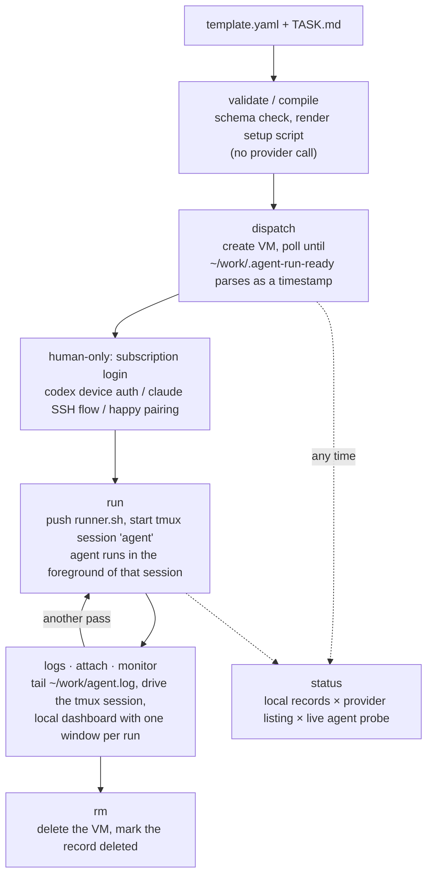

# agent-run

Dispatch, run, watch, and destroy disposable VMs that a coding agent works in.

A **template** (`templates/*.yaml`, validated by `templates/schema.json`) says what
an environment needs — resources, repositories, allowed runtimes, env, setup
steps, readiness checks — and nothing about how a provider builds it. A
**provider adapter** compiles that into one provider's lifecycle calls. Today the
only adapter is `exe.dev`.

The durable interface is the **template plus the task envelope** (`TASK.md`, the
run record, the sandbox choice). The VM adapter underneath is replaceable; the
template you wrote is not.

Flags and defaults live in `agent-run <command> --help`. This file covers what
`--help` cannot: the shape of a full run, the security model, and the platform
behaviour that shaped the design.

Requires `python3` with `pyyaml` and `jsonschema`. Invoke it as
`agent-run/bin/agent-run` from the repo root, or put `bin/` on your `PATH`.

## Lifecycle



Run records are machine-local JSON under `~/.local/state/agent-run/runs/`
(override with `AGENT_RUN_STATE_PATH`). They are state, not repo content.

## Commands

### validate

Schema check plus the forbidden-env check. Touches no provider.

```sh
agent-run/bin/agent-run validate agent-run/templates/lightdash-dev.yaml
# agent-run/templates/lightdash-dev.yaml: valid
```

### compile

Renders the setup script to a file and prints the creation command for you to
read or run yourself. Executes nothing.

```sh
agent-run/bin/agent-run compile agent-run/templates/lightdash-dev.yaml \
  --runtime codex --name task-a --script-out /tmp/task-a-setup.sh
# setup script -> /tmp/task-a-setup.sh (447 bytes)   [stderr]
# ssh exe.dev new --json --name=task-a --cpu=4 --memory=8GB --disk=50GB \
#   --image=exeuntu --env=NODE_ENV=development --integration=github \
#   --tag=agent-pilot --comment=agent-run:lightdash-dev:codex \
#   --setup-script=/dev/stdin < /tmp/task-a-setup.sh
```

Run metadata rides `--comment` as `agent-run:<template>:<runtime>`, which makes a
VM traceable back to the template that produced it.

### dispatch

Compile, create the VM, poll for the readiness marker, optionally push the
prompt, save the run record. Safe to run in parallel under different `--name`s;
a name with a live record is refused.

```sh
agent-run/bin/agent-run dispatch agent-run/templates/lightdash-dev.yaml \
  --runtime codex --name task-a --prompt-file task-a.md
# creating VM: ssh exe.dev new --json --name=task-a ...      [stderr]
# created VM 'task-a' (u123@task-a.exe.xyz)                  [stderr]
# prompt copied to ~/work/TASK.md                            [stderr]
# task-a: ready (u123@task-a.exe.xyz)
#
# next, the human-only part:
#   ssh -t exe.dev ssh task-a
#   codex login --device-auth
#   ...
```

`--no-wait` returns as soon as the VM exists; `agent-run status` promotes the
record to `ready` when the marker appears. Subscription login is deliberately
not automated — `dispatch` stops at ready and prints the steps.

### run

Starts the agent on a ready VM, inside a detached tmux session named `agent`.
One session per VM: one VM, one task. The runner stays in the foreground of the
session, so `tmux has-session` is a truthful liveness probe, and the agent's
exit code lands in `~/work/.agent-run-exit`.

```sh
agent-run/bin/agent-run run task-a --prompt-file task-a.md
# task-a: agent started (codex, sandbox workspace-write)
#   watch:  agent-run logs task-a --follow
#   drive:  agent-run attach task-a
```

Starting a second agent over a live one needs `--force`. The prompt is read from
`~/work/TASK.md` on the VM rather than interpolated into a command, so no
model-facing text ever passes through the gateway's argument parsing.

### status

Local records, cross-checked against the provider's VM listing, with a live
agent probe per reachable run.

```sh
agent-run/bin/agent-run status
# task-a   ready          running       codex  u123@task-a.exe.xyz   2026-08-14T05:00:00Z
# task-b   provisioning?  -             claude u456@task-b.exe.xyz   2026-08-14T05:20:00Z
# task-c   missing        -             codex  u789@task-c.exe.xyz   2026-08-13T11:02:00Z

agent-run/bin/agent-run status --json | jq '.runs[] | select(.agent == "running")'
```

| VM status        | Meaning                                                     |
| ---------------- | ----------------------------------------------------------- |
| `ready`          | Readiness marker read and parsed                             |
| `provisioning?`  | No marker yet — still setting up, or setup failed            |
| `missing`        | Local record exists, the provider no longer lists the VM     |
| `deleted`        | `rm` has run                                                 |

| Agent state   | Meaning                                                  |
| ------------- | -------------------------------------------------------- |
| `not-started` | VM ready, no `run` yet                                    |
| `running`     | tmux session alive                                        |
| `exited(N)`   | Session gone, exit file says `N` (`?` if it was unwritten) |
| `unreachable` | Probe output could not be parsed                          |

`--offline` skips every network call and reports local records only.

### logs

`--source auto` (the default) reads the first-boot setup journal before the
agent starts, and `~/work/agent.log` after it does.

```sh
agent-run/bin/agent-run logs task-a --source setup --lines 100   # why is it still provisioning?
agent-run/bin/agent-run logs task-a --follow                     # stream the agent until interrupted
```

`--follow` streams the agent log; the setup log is already finished by the time
an agent exists, so that combination is refused.

### attach

Hands your terminal to the run's tmux session — the way to answer a prompt or
steer the agent mid-run. Requires a live agent.

```sh
agent-run/bin/agent-run attach task-a
# detach with the usual tmux binding (ctrl-b d); the agent keeps running
```

### monitor

A **local** tmux dashboard with one window per live run, each following that
run's log. Idempotent: re-running opens windows for new runs and prunes gone
ones, leaving the window you are watching untouched.

```sh
agent-run/bin/agent-run monitor
# agent-run: 2 run(s) — task-a, task-b
#   opened:  task-b
#
# attach with:  tmux attach -t agent-run
```

### rm

Deletes the VM and marks the record deleted. Re-checks the provider listing
first, so a VM that is already gone is reconciled without a delete call.

```sh
agent-run/bin/agent-run rm task-a          # asks first
agent-run/bin/agent-run rm task-a --yes    # for scripts
```

## Template contract

`templates/schema.json` is the authority; this is the shape it accepts.

```yaml
version: 1
name: lightdash-dev            # also the default run and VM name prefix
resources: { cpu: 4, memory: 8GB, disk: 50GB }
runtimes: [codex, claude]      # allowed; the actual one is a --runtime flag
repos:
  - id: github.com/lightdash/lightdash   # host/owner/repo
    ref: main
    path: lightdash            # checkout dir under $HOME/work
    role: primary              # where the agent starts; first repo if unset
env:
  NODE_ENV: development        # plaintext on the VM — non-secret config only
setup:
  - update-runtimes            # named step: updates only the selected runtime
  - install-happy              # named step: npm install -g happy
  - run: corepack enable && pnpm install
    cwd: lightdash
checks:                        # each must exit 0 before the marker is written
  - node --version
providers:                     # the only place provider specifics may appear
  exe.dev:
    image: exeuntu
    integrations: [github]     # switches clones to github.int.exe.xyz
    tags: [agent-pilot]
```

The generated first-boot script clones the repos, runs the setup steps, runs the
checks, then writes `date -u +%FT%TZ` into `$HOME/work/.agent-run-ready`. That
marker is the readiness contract.

Two size limits apply: the setup script must stay under 10 KiB (exe.dev's cap)
and a pushed file such as `TASK.md` under 96 KiB. Anything larger belongs in a
repo the template clones.

## Security model

| Rule                                                     | How it holds                                                                          |
| -------------------------------------------------------- | ------------------------------------------------------------------------------------- |
| No provider API key ever reaches a VM                     | `load_template` rejects `OPENAI_API_KEY` / `ANTHROPIC_API_KEY` in `env` (`FORBIDDEN_ENV`) |
| Model access is credential-free on the VM                 | Traffic rides the exe.dev LLM integration gateway (`llm.int.exe.xyz`); the credential is injected at the network layer and is never readable on the VM |
| Repo access is scoped to the repos you asked for          | A repo-scoped GitHub integration via `github.int.exe.xyz`, selected by `integrations: [github]`; without it, public repos clone anonymously from `https://<host>/…` |
| `env` carries configuration, not secrets                  | Template `env` becomes `--env=K=V` on the creation command and is plaintext on the VM  |
| Secrets stay out of the repo                              | Templates are committed; run records, prompts, and credentials are not                |

Agent authentication is a subscription login performed by a human on the VM
(`codex login --device-auth`, the Claude Code SSH flow, or `happy` pairing).
That is why `dispatch` stops at ready rather than continuing into `run`.

## Choosing a sandbox

`agent-run run --sandbox` is the one call the operator makes consciously. Each
runtime spells the same privilege levels differently, so the flag is translated
rather than passed through — it means the same thing whichever runtime runs:

| `--sandbox`          | codex                            | claude                            |
| -------------------- | -------------------------------- | --------------------------------- |
| `read-only`          | `--sandbox read-only`            | `--permission-mode plan`          |
| `workspace-write`    | `--sandbox workspace-write`      | `--permission-mode acceptEdits`   |
| `danger-full-access` | `--sandbox danger-full-access`   | `--permission-mode bypassPermissions` |

|                                    | `workspace-write` (default) | `danger-full-access` |
| ---------------------------------- | --------------------------- | -------------------- |
| Edit the checkout                  | yes                         | yes                  |
| `.git` writable — branch, commit   | no                          | yes                  |
| Isolation boundary                 | the runtime sandbox, then the VM | the VM alone    |

`workspace-write` is the least privilege that still lets an agent edit the
checkout, and it makes `.git` read-only, so the agent cannot create a branch or
commit (openai/codex[#15505](https://github.com/openai/codex/issues/15505),
[#14338](https://github.com/openai/codex/issues/14338)). A run that must produce
commits needs `danger-full-access`, which accepts the disposable VM as the only
thing standing between the agent and the machine it is on. `read-only` is
available for inspection runs.

Pick per run, not per template: the choice belongs to the task, and `status`
reports which one a run started with.

## Platform behaviour

Each of these is a fact about exe.dev that the tool is shaped around.

| Fact                                                                                              | Consequence                                                                                                                |
| ------------------------------------------------------------------------------------------------- | -------------------------------------------------------------------------------------------------------------------------- |
| The gateway strips shell quoting from `ssh exe.dev ssh <vm> '<cmd>'`; quoted multi-word arguments arrive split | File content and scripts travel base64-encoded in a single whitespace-free token (`push_file`), and every remote command the tool sends is quote-free |
| The gateway does not forward stdin to the VM                                                      | Nothing can be piped into a remote command; content must ride in the command line, base64-encoded                          |
| The same no-quoting rule applies to `ssh exe.dev new` arguments                                   | `compile` rejects any argument containing whitespace, so a template `env` value like `hello world` fails at compile time     |
| Direct `ssh <vm>.exe.xyz` can land in the exe.dev REPL instead of the VM                          | All remote execution routes through `ssh exe.dev ssh <vm>`, including `attach` and `logs --follow`                          |
| The SSH key is tag-scoped, so unknown `--tag` values are rejected                                 | Run metadata rides `--comment`; template `tags:` must match what your key allows                                            |
| The `exeuntu` image ships git and the agent CLIs, but no node or npm                              | Any node-dependent setup step — `install-happy`, `pnpm install` — needs node installed by an earlier `run:` step            |
| The gateway exits 0 even when the inner command fails, and folds inner stderr into stdout         | Neither the exit code nor non-empty stdout proves anything; readiness is proved only by output matching `YYYY-MM-DDTHH:MM:SSZ`, and the agent probe accepts only `RUNNING` or `DONE:<code>` |

## Troubleshooting

| Symptom                                                     | Cause                                                     | Fix                                                                       |
| ------------------------------------------------------------ | ---------------------------------------------------------- | -------------------------------------------------------------------------- |
| `VM did not become ready within Ns`                          | Setup still running, or a setup step failed               | `agent-run logs <name> --source setup`; fix the template and re-dispatch   |
| `status` shows `provisioning?`                               | Marker absent — same two causes                            | Same; `--wait-timeout` buys time for a genuinely slow setup                |
| `status` shows `missing`                                     | VM gone at the provider, local record still live          | `agent-run rm <name>` to reconcile the record                             |
| `npm: command not found` in the setup log                    | `exeuntu` ships no node/npm                               | Install node in a `run:` step before `install-happy` or any pnpm step      |
| `argument would be split by the provider's parser`           | Whitespace in an `env` value, name, or tag                | Remove the whitespace; move multi-word config into the repo                |
| Creation fails with `--tag not allowed`                      | The SSH key is scoped to specific tags                    | Use a tag your key allows; run metadata already rides `--comment`         |
| Agent state is `unreachable`                                 | Probe output was neither `RUNNING` nor `DONE:<code>`      | `agent-run logs <name>`, or `ssh -t exe.dev ssh <vm>` and look             |
| Agent cannot create a branch or commit                       | `workspace-write` keeps `.git` read-only                  | Re-run with `--sandbox danger-full-access`                                |
| `an agent is already running`                                | A live tmux session on that VM                            | `agent-run attach <name>`, or `agent-run run <name> --force`              |
| Dropped into a REPL after `ssh <vm>.exe.xyz`                 | Direct routing is unreliable                              | `ssh -t exe.dev ssh <vm>`                                                 |

## Adding a provider

Write a `compile_<provider>(template, runtime, name)` in `bin/agent-run`
returning `(argv, setup_script)`, and register it in `ADAPTERS`. Templates gain
at most a new block under `providers:`; the neutral core must keep compiling
unchanged for the providers that already exist.

## Tests

```sh
python3 agent-run/tests/test_agent_run.py
```
