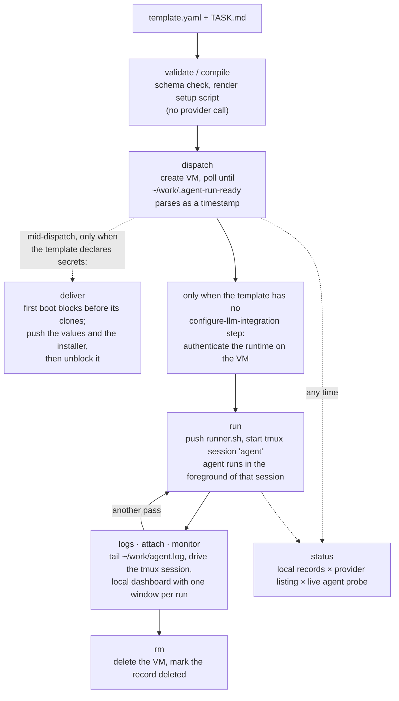

# agent-run

Dispatch, run, watch, and destroy disposable VMs that a coding agent works in.

A **template** (`templates/*.yaml`, validated by `templates/schema.json`) says what
an environment needs — resources, repositories, allowed runtimes, env, setup
steps, readiness checks — and nothing about how a provider builds it. A
**provider adapter** compiles that into one provider's lifecycle calls. Today the
only adapter is `exe.dev`.

The durable interface is the **template plus the task envelope** (`TASK.md`, the
run record, the sandbox choice). The VM adapter underneath is replaceable; the
template you wrote is not.

Flags and defaults live in `agent-run <command> --help`. This file covers what
`--help` cannot: the shape of a full run, the security model, and the platform
behaviour that shaped the design.

Requires `python3` with `pyyaml` and `jsonschema`. Invoke it as
`agent-run/bin/agent-run` from the repo root, or put `bin/` on your `PATH`.

## Lifecycle



Run records are machine-local JSON under `~/.local/state/agent-run/runs/`
(override with `AGENT_RUN_STATE_PATH`). They are state, not repo content.

## Commands

### validate

Schema check, repo checks, and the forbidden-env check. Touches no provider.
Reports the compiled setup script against exe.dev's 10 KiB cap, per runtime, so
a template creeping toward the limit says so while there is still room to act.

```sh
agent-run/bin/agent-run validate agent-run/templates/dot-files.yaml
# agent-run/templates/dot-files.yaml: valid
#   setup script (codex): 1378 / 10240 bytes (13%)
#   setup script (claude): 1344 / 10240 bytes (13%)
```

### compile

Renders the setup script to a file and prints the creation command for you to
read or run yourself. Executes nothing.

```sh
agent-run/bin/agent-run compile agent-run/templates/dot-files.yaml \
  --runtime codex --name task-a --script-out /tmp/task-a-setup.sh
# setup script -> /tmp/task-a-setup.sh (1378 bytes)   [stderr]
# ssh exe.dev new --json --name=task-a --cpu=2 --memory=4GB --disk=20GB \
#   --image=exeuntu --comment=agent-run:dot-files:codex \
#   --setup-script=/dev/stdin < /tmp/task-a-setup.sh
```

Run metadata rides `--comment` as `agent-run:<template>:<runtime>`, which makes a
VM traceable back to the template that produced it.

### dispatch

Resolve any declared secrets, compile, create the VM, deliver those secrets, poll
for the readiness marker, optionally push the prompt, save the run record. Safe
to run in parallel under different `--name`s; a name with a live record is
refused.

```sh
agent-run/bin/agent-run dispatch agent-run/templates/dot-files.yaml \
  --runtime codex --name task-a --prompt-file task-a.md
# creating VM: ssh exe.dev new --json --name=task-a ...      [stderr]
# created VM 'task-a' (u123@task-a.exe.xyz)                  [stderr]
# prompt copied to ~/work/TASK.md                            [stderr]
# task-a: ready (u123@task-a.exe.xyz)
#
# next:
#   agent-run run task-a --prompt-file <task.md>
#   agent-run logs task-a --follow
```

That is the output for a template carrying `configure-llm-integration`, which is
every shipped one. Without that step the runtime has no model access, and
`dispatch` prints the login to run on the VM instead — subscription login is
deliberately not automated.

A template that declares `secrets:` adds two lines before the VM exists and one
after, because delivery is a [handshake](#how-it-gets-there):

```text
# resolved 1 secret(s): GITHUB_TOKEN                          [stderr]
# creating VM: ...                                            [stderr]
# delivered 1 secret(s); boot resumed                          [stderr]
```

`--no-wait` returns as soon as the VM exists; `agent-run status` promotes the
record to `ready` when the marker appears. It is refused for a template with
`secrets:`, whose first boot is blocked waiting for a delivery that returning
early would never make.

### run

Starts the agent on a ready VM, inside a detached tmux session named `agent`.
One session per VM: one VM, one task. The runner stays in the foreground of the
session, so `tmux has-session` is a truthful liveness probe, and the agent's
exit code lands in `~/work/.agent-run-exit`.

```sh
agent-run/bin/agent-run run task-a --prompt-file task-a.md
# task-a: agent started (codex, sandbox workspace-write)
#   watch:  agent-run logs task-a --follow
#   drive:  agent-run attach task-a
```

Starting a second agent over a live one needs `--force`. The prompt is read from
`~/work/TASK.md` on the VM rather than interpolated into a command, so no
model-facing text ever passes through the gateway's argument parsing.

### status

Local records, cross-checked against the provider's VM listing, with a live
agent probe per reachable run.

```sh
agent-run/bin/agent-run status
# task-a   ready          running       codex  u123@task-a.exe.xyz   2026-08-14T05:00:00Z
# task-b   provisioning?  -             claude u456@task-b.exe.xyz   2026-08-14T05:20:00Z
# task-c   missing        -             codex  u789@task-c.exe.xyz   2026-08-13T11:02:00Z

agent-run/bin/agent-run status --json | jq '.runs[] | select(.agent == "running")'
```

| VM status        | Meaning                                                     |
| ---------------- | ----------------------------------------------------------- |
| `ready`          | Readiness marker read and parsed                             |
| `provisioning?`  | No marker yet — still setting up, or setup failed            |
| `missing`        | Local record exists, the provider no longer lists the VM     |
| `deleted`        | `rm` has run                                                 |

| Agent state   | Meaning                                                  |
| ------------- | -------------------------------------------------------- |
| `not-started` | VM ready, no `run` yet                                    |
| `running`     | tmux session alive                                        |
| `exited(N)`   | Session gone, exit file says `N` (`?` if it was unwritten) |
| `unreachable` | Probe output could not be parsed                          |

`--offline` skips every network call and reports local records only.

### logs

`--source auto` (the default) reads the first-boot setup journal before the
agent starts, and `~/work/agent.log` after it does.

```sh
agent-run/bin/agent-run logs task-a --source setup --lines 100   # why is it still provisioning?
agent-run/bin/agent-run logs task-a --follow                     # stream the agent until interrupted
```

`--follow` streams the agent log; the setup log is already finished by the time
an agent exists, so that combination is refused.

### attach

Hands your terminal to the run's tmux session — the way to answer a prompt or
steer the agent mid-run. Requires a live agent.

```sh
agent-run/bin/agent-run attach task-a
# detach with the usual tmux binding (ctrl-b d); the agent keeps running
```

### monitor

A **local** tmux dashboard with one window per live run, each following that
run's log. Idempotent: re-running opens windows for new runs and prunes gone
ones, leaving the window you are watching untouched.

```sh
agent-run/bin/agent-run monitor
# agent-run: 2 run(s) — task-a, task-b
#   opened:  task-b
#
# attach with:  tmux attach -t agent-run
```

### rm

Deletes the VM and marks the record deleted. Re-checks the provider listing
first, so a VM that is already gone is reconciled without a delete call.

```sh
agent-run/bin/agent-run rm task-a          # asks first
agent-run/bin/agent-run rm task-a --yes    # for scripts
```

### secret

Registers the command that fetches a credential, so a template can name it
without holding it. Touches no provider. Full treatment in
[Credentials](#credentials).

```sh
agent-run/bin/agent-run secret set GITHUB_TOKEN --command 'gh auth token'
agent-run/bin/agent-run secret ls
agent-run/bin/agent-run secret rm GITHUB_TOKEN
```

## Template contract

`templates/schema.json` is the authority; this is the shape it accepts.

```yaml
version: 1
name: example-dev              # also the default run and VM name prefix
resources: { cpu: 4, memory: 8GB, disk: 50GB }
expose:                        # optional; see "Dev environments"
  port: 3000
  access: team                 # private | team | link | public
runtimes: [codex, claude]      # allowed; the actual one is a --runtime flag
repos:
  - id: github.com/org/app     # host/owner/repo
    ref: main
    path: app                  # checkout dir under $HOME/work
    role: primary              # where the agent starts
    private: true              # clone via github.int.exe.xyz
    setup:                     # runs inside this checkout; takes no cwd
      - run: pnpm install --frozen-lockfile
env:
  NODE_ENV: development        # plaintext on the VM — non-secret config only
setup:                         # template-wide: provisions the box, runs first
  - update-runtimes            # named step: updates only the selected runtime
  - run: curl -fsSL https://deb.nodesource.com/setup_22.x | sudo -E bash -
checks:                        # each must exit 0 before the marker is written
  - node --version
providers:                     # the only place provider specifics may appear
  exe.dev:
    image: exeuntu
    integrations: [github]     # switches clones to github.int.exe.xyz
    tags: [agent-pilot]
```

The generated first-boot script clones the repos, writes the manifest, runs the
template-wide setup steps, runs each repo's own setup steps, runs the checks,
then writes `date -u +%FT%TZ` into `$HOME/work/.agent-run-ready`. That marker is
the readiness contract.

## Dev environments

A box earns its keep when someone else can open it. exe.dev proxies one port per
VM over HTTPS, private by default; `expose:` makes that part of what the box *is*,
so the URL exists the moment the box is ready rather than after three commands you
had to remember.

```yaml
expose:
  port: 3000                   # what the service listens on inside the VM
  access: team                 # private | team | link | public
  domain: ld-dev.example.com   # optional; the CNAME must already point at exe.dev
```

| `access` | Who can open it | Use it for |
| --- | --- | --- |
| `private` | Only you | The default. A box you are testing yourself |
| `team` | Your exe.dev team | Teammates who have accounts |
| `link` | Anyone with the URL, once signed in | A reviewer outside your exe.dev team |
| `public` | The open web | Something genuinely meant to be public |

Applied **after** the readiness marker, because proxying a port nothing is
listening on just serves 502s to whoever you sent the link to. `dispatch` prints
the URL and stores it in the run record — a box whose URL you cannot find is a box
nobody tests.

Two platform facts about the service behind the port, both learned from a live
box rather than the docs. First, a service started in `setup:` with `nohup … &`
**dies when setup finishes** — the setup script runs as a systemd unit and its
whole cgroup is reaped on exit. Start anything that must outlive setup as its
own unit:

```yaml
setup:
  - run: sudo systemd-run --unit=app --working-directory=/home/exedev/work/app python3 -m http.server 8000
```

Second, `checks:` run once, immediately — a check that probes a service started
one step earlier will race it and lose. Give it a retry window:

```yaml
checks:
  - timeout 90 bash -c 'until curl -sf http://localhost:8000; do sleep 2; done'
```

Two things the schema enforces, both of them platform facts rather than taste:
`expose` is an object and not a list, because exe.dev proxies a single port per VM
(put several services behind one entry point, or give each its own box); and a
`domain` with `access: private` is refused, since the certificate and the CNAME
would be work done for an audience of one. `validate` warns on `public` — not an
error, but the one setting with no second chance.

**What sharing does and does not open.** `share add` grants **web access only**;
shell access is a separate `--root` flag that `expose:` never passes. So a
teammate testing your app cannot reach the credentials on the box. What they *can*
reach is the app — a dev-mode service with real data behind no auth is the thing
to think about before choosing `public`.

## Several repos on one box

`repos` is a list, and everything above scales to it. Two rules are enforced at
validate time rather than left to fail on the VM:

| Rule | Why |
| --- | --- |
| No two repos may resolve to the same checkout directory | Both would clone to `$WORK/<name>` and the second would fail deep in the setup journal, long after dispatch reported success. Give all but one an explicit `path:` |
| With more than one repo, exactly one must be `role: primary` | It decides where the agent starts. With no marker the choice falls to declaration order, which is an accident rather than a decision. A single-repo template needs no marker |

Each repo may carry its own `setup:` block, which runs with that checkout as the
working directory. Ordering is:

```text
clones -> REPOS.md -> template-wide setup -> per-repo setup -> checks
```

The split is machine-level versus repo-level. The template-wide list provisions
the box — the language runtime, the package manager, `configure-llm-integration`
— and a repo's own `pnpm install` is exactly the thing that depends on it, so
per-repo steps run last. Anything that has to happen *before* a repo's own steps
belongs in the template-wide list.

The script also writes `$HOME/work/REPOS.md`, a table of what was cloned, where,
at which ref, and which one is primary:

```markdown
| Path | Repository | Ref | Role |
| --- | --- | --- | --- |
| `~/work/lightdash` | github.com/lightdash/lightdash | main | primary |
| `~/work/dot-files` | github.com/almeidabbm/dot-files | (default) | secondary |
```

Without it the only repo an agent is told about is the one it starts in, so every
other checkout is something it has to stumble across. Point at it from `TASK.md`
when a task genuinely spans repositories.

Two size limits apply: the setup script must stay under 10 KiB (exe.dev's cap)
and a pushed file such as `TASK.md` under 96 KiB. Anything larger belongs in a
repo the template clones. `validate` reports the first of these as a percentage,
so a template approaching it says so before a dispatch fails.

A template may also declare `secrets:` and a repo may set `auth:`; both are
covered under [Credentials](#credentials).

## Credentials

Prefer an exe.dev integration wherever one exists: the credential is injected at
the network layer and is genuinely never on the VM. `secrets:` is for what
integrations cannot cover — a PAT for a host exe.dev has no integration with, a
registry token, a fine-grained token scoped more tightly than the integration.

### Registering one

The local store holds **resolver commands, never values**. Nothing secret is
written to your disk by `agent-run`, and rotating a credential at its source
needs no action here.

```sh
agent-run secret set GITHUB_TOKEN --command 'gh auth token'
agent-run secret set NPM_TOKEN --command 'op read op://private/npm/token'

agent-run secret ls
# GITHUB_TOKEN             ok     gh auth token
# NPM_TOKEN                FAILS  op read op://private/npm/token
```

The command is stored, so it must *fetch* the credential rather than contain it.
`--command 'echo ghp_…'` writes the value straight back to disk; `set` warns when
a command looks like that.

### Declaring one in a template

```yaml
secrets:
  - name: GITHUB_TOKEN         # must match a registered name
    type: git-credential
    host: github.com
    username: x-access-token   # optional; this is the default, what a PAT expects
  - name: NPM_TOKEN
    type: file
    path: .npmrc               # relative to $HOME, written 0600
    format: "//registry.npmjs.org/:_authToken={{value}}"

repos:
  - id: github.com/org/private-thing
    role: primary
    auth: GITHUB_TOKEN         # clone with this credential
```

`auth:` and `private:` are two different routes to the same repo — the gateway
versus a credential — so a repo may set one, not both. A credential whose `host`
does not match the repo's is refused at validate time: git's store helper matches
on host, so it would never be offered and the clone would sit waiting for a
password nobody can type.

### How it gets there

The token cannot ride the setup script — that runs under `set -euxo pipefail`, so
anything it touched would be echoed into the journal `logs --source setup` prints.
It cannot ride `--env` either, which is provider metadata and the agent's own
environment. So first boot pauses and dispatch fills the gap:

```mermaid
sequenceDiagram
    participant D as dispatch (your machine)
    participant B as first boot (the VM)
    D->>D: resolve every secret locally, before creating anything
    D->>B: create VM
    B->>B: mkdir ~/.agent-run/secrets (0700)
    B-->>D: touch ~/work/.agent-run-awaiting-secrets
    B->>B: block, polling for .complete
    D->>B: push each value (0600) then install-secrets.sh
    D->>B: touch .complete
    B->>B: set +x; bash install-secrets.sh; set -x
    B->>B: clone, setup, checks, write .agent-run-ready
```

Resolution happens before the VM exists on purpose: an unregistered secret found
later would leave a box whose boot script is already blocked waiting for it. For
the same reason `--no-wait` is refused for a template that declares secrets.

`install-secrets.sh` is generated from the declarations alone and contains no
value — it reads each one from the file dispatch pushed. It runs `set -eu` with
tracing deliberately absent.

### What this does and does not protect

| The credential is kept out of | How |
| --- | --- |
| The template, and therefore git | `secrets:` carries names; a test asserts no shipped template holds a credential-shaped value |
| Your disk | The store holds the resolver command, not its output |
| The creation command line and VM metadata | It is never an `--env`; token-shaped `env` names are refused with a pointer here |
| The setup journal | Delivered after boot starts, installed by a script that never enables tracing |
| The run record | The record stores secret names only |
| The agent's environment | Installed into files git reads, never exported |
| `.git/config` | An `auth:` repo clones from the ordinary URL; the credential comes from the store helper, matched on host |

**It is not out of the agent's reach, and this is not a bug you can fix.** The
agent has a shell on that VM and runs as the user that owns `~/.git-credentials`.
Anything git can read, an agent that goes looking can read. The VM stays the real
boundary, which means:

- Scope the token to what the task needs — a fine-grained, read-only PAT for one
  repo, not a classic token with `repo` scope.
- Prefer an exe.dev integration when one exists. Nothing above beats a credential
  that was never on the box.
- Delete the VM when the evidence is captured. `agent-run rm` is the control that
  actually bounds exposure.

One more honest limit: the value transits the exe.dev gateway base64-encoded in a
command line, because the gateway forwards no stdin and there is no other channel.
Base64 is not encryption. exe.dev sees it in transit, and delivery happens before
any agent is started, so nothing on the VM is running to observe it.

## Security model

| Rule                                                     | How it holds                                                                          |
| -------------------------------------------------------- | ------------------------------------------------------------------------------------- |
| No provider API key ever reaches a VM                     | `load_template` rejects `OPENAI_API_KEY` / `ANTHROPIC_API_KEY` in `env` (`FORBIDDEN_ENV`) |
| Model access is credential-free on the VM                 | Traffic rides the exe.dev LLM integration gateway (`llm.int.exe.xyz`); the credential is injected at the network layer and is never readable on the VM |
| Repo access is scoped to the repos you asked for          | A repo-scoped GitHub integration via `github.int.exe.xyz`, selected by `integrations: [github]`; without it, public repos clone anonymously from `https://<host>/…` |
| `env` carries configuration, not secrets                  | Template `env` becomes `--env=K=V` on the creation command and is plaintext on the VM; token-shaped names are refused outright |
| A credential you must supply yourself stays off your disk | `secrets:` names it, `agent-run secret` stores the command that fetches it, and delivery happens after boot — see [Credentials](#credentials) |
| Secrets stay out of the repo                              | Templates are committed; run records, prompts, and credentials are not                |

Agent authentication normally needs no human at all: the
`configure-llm-integration` step discovers which attached LLM integration serves
the chosen runtime and configures it, so no credential is written to the VM and
no login happens. A template without that step leaves the runtime unauthenticated,
and `dispatch` then prints the manual login to run before `agent-run run`.

## Three ways to start work

| You want | Command |
| --- | --- |
| Run a task and walk away | `agent-run run <name> --prompt-file <file>` |
| Drive the runtime by hand | `agent-run run <name> --interactive`, then `attach` |
| Just a shell on the box | `agent-run shell <name>` |

`--prompt-file` is required the first time. It becomes optional afterwards, because
a run leaves its prompt at `~/work/TASK.md` and a repeat run reuses it — which is the
whole point of the flag being optional. Starting with neither a prompt nor
`--interactive` is refused: the runtime would read an empty task, answer a question
nobody asked, and exit 0.

`--interactive` starts the runtime's own UI instead of a one-shot task. It reads no
prompt and captures no log, so `logs` has nothing to show for it — the tmux session
is the record. It takes the same `--sandbox`, mapped per runtime.

`shell` involves no agent at all: an interactive shell on the VM, for reading the
checkout, running tests yourself, or finishing a manual login.

## Watching a run

Four questions, four commands:

| Question | Command |
| --- | --- |
| What is running, and is it alive? | `agent-run status [--json]` |
| What is it doing right now? | `agent-run logs <name> --follow` |
| How is it going, and what is it costing? | `agent-run stat <name> [--json]` |
| Show me everything at once | `agent-run monitor` |

To end a run without losing it, `agent-run stop <name>` kills the agent and leaves
the VM and its output in place — the work stays inspectable with `logs`, `shell`,
or another `run`. `agent-run rm <name>` is the one that destroys the VM.

Because killing the session means the runner never writes its own exit code, `stop`
writes 130 — terminated by SIGINT — so `status` shows the run ended and did not end
by itself.

`stat` reports agent state, elapsed time, tokens the runtime has reported using,
and a resource sample — cpu, **memory**, disk, network, io. Memory leads because
exe.dev's own `stat` table omits it, and memory is what actually kills a build on
an 8GB box; it is flagged at 90% and above.

`monitor` builds a tmux session with one window per run plus a `resources.`
window looping `stat` over all of them. The trailing dot keeps that name outside
the space of valid run names, so it cannot be shadowed or pruned.

Tokens come from the runtime's own output, so they are available in task mode and
not in `--interactive`, which captures no log by design.

## Choosing a sandbox

`agent-run run --sandbox` is the one call the operator makes consciously. Each
runtime spells the same privilege levels differently, so the flag is translated
rather than passed through — it means the same thing whichever runtime runs:

| `--sandbox`          | codex                            | claude                            |
| -------------------- | -------------------------------- | --------------------------------- |
| `read-only`          | `--sandbox read-only`            | `--permission-mode plan`          |
| `workspace-write`    | `--sandbox workspace-write`      | `--permission-mode acceptEdits`   |
| `danger-full-access` | `--sandbox danger-full-access`   | `--permission-mode bypassPermissions` |

|                                    | `workspace-write` (default) | `danger-full-access` |
| ---------------------------------- | --------------------------- | -------------------- |
| Edit the checkout                  | yes                         | yes                  |
| `.git` writable — branch, commit   | no                          | yes                  |
| Isolation boundary                 | the runtime sandbox, then the VM | the VM alone    |

`workspace-write` is the least privilege that still lets an agent edit the
checkout, and it makes `.git` read-only, so the agent cannot create a branch or
commit (openai/codex[#15505](https://github.com/openai/codex/issues/15505),
[#14338](https://github.com/openai/codex/issues/14338)). A run that must produce
commits needs `danger-full-access`, which accepts the disposable VM as the only
thing standing between the agent and the machine it is on. `read-only` is
available for inspection runs.

Pick per run, not per template: the choice belongs to the task, and `status`
reports which one a run started with.

## Platform behaviour

Each of these is a fact about exe.dev that the tool is shaped around.

| Fact                                                                                              | Consequence                                                                                                                |
| ------------------------------------------------------------------------------------------------- | -------------------------------------------------------------------------------------------------------------------------- |
| Interactive sessions (`attach`, `shell`) connect directly to the VM, because the gateway allocates no TTY — even `ssh -tt exe.dev ssh <vm> tty` reports "not a tty" | Command execution stays on the gateway, where a direct call carrying a command can land in the exe.dev REPL |
| The gateway strips shell quoting from `ssh exe.dev ssh <vm> '<cmd>'`; quoted multi-word arguments arrive split | File content and scripts travel base64-encoded in a single whitespace-free token (`push_file`), and every remote command the tool sends is quote-free |
| The gateway does not forward stdin to the VM                                                      | Nothing can be piped into a remote command; content must ride in the command line, base64-encoded                          |
| The same no-quoting rule applies to `ssh exe.dev new` arguments                                   | `compile` rejects any argument containing whitespace, so a template `env` value like `hello world` fails at compile time     |
| Direct `ssh <vm>.exe.xyz` can land in the exe.dev REPL instead of the VM                          | All remote execution routes through `ssh exe.dev ssh <vm>`, including `attach` and `logs --follow`                          |
| The SSH key is tag-scoped, so unknown `--tag` values are rejected                                 | Run metadata rides `--comment`; template `tags:` must match what your key allows                                            |
| The `exeuntu` image ships git and the agent CLIs, but no node or npm                              | Any node-dependent setup step — `pnpm install` — needs node installed by an earlier `run:` step; NodeSource works           |
| The gateway exits 0 even when the inner command fails, and folds inner stderr into stdout         | Neither the exit code nor non-empty stdout proves anything; readiness is proved only by output matching `YYYY-MM-DDTHH:MM:SSZ`, and the agent probe accepts only `RUNNING` or `DONE:<code>` |

## Troubleshooting

| Symptom                                                     | Cause                                                     | Fix                                                                       |
| ------------------------------------------------------------ | ---------------------------------------------------------- | -------------------------------------------------------------------------- |
| `VM did not become ready within Ns`                          | Setup still running, or a setup step failed               | `agent-run logs <name> --source setup`; fix the template and re-dispatch   |
| `status` shows `provisioning?`                               | Marker absent — same two causes                            | Same; `--wait-timeout` buys time for a genuinely slow setup                |
| `status` shows `missing`                                     | VM gone at the provider, local record still live          | `agent-run rm <name>` to reconcile the record                             |
| `npm: command not found` in the setup log                    | `exeuntu` ships no node/npm                               | Install node from NodeSource in a `run:` step before any pnpm step         |
| `argument would be split by the provider's parser`           | Whitespace in an `env` value, name, or tag                | Remove the whitespace; move multi-word config into the repo                |
| Creation fails with `--tag not allowed`                      | The SSH key is scoped to specific tags                    | Use a tag your key allows; run metadata already rides `--comment`         |
| Agent state is `unreachable`                                 | Probe output was neither `RUNNING` nor `DONE:<code>`      | `agent-run logs <name>`, or `ssh -t exe.dev ssh <vm>` and look             |
| Agent cannot create a branch or commit                       | `workspace-write` keeps `.git` read-only                  | Re-run with `--sandbox danger-full-access`                                |
| `an agent is already running`                                | A live tmux session on that VM                            | `agent-run attach <name>`, or `agent-run run <name> --force`              |
| Dropped into a REPL after `ssh <vm>.exe.xyz`                 | Direct routing is unreliable                              | `ssh -t exe.dev ssh <vm>`                                                 |
| `env looks like it carries a credential`                     | A token-shaped name in `env:`                             | Declare it under `secrets:` and register it with `agent-run secret set`   |
| `no secret named 'X'`                                        | The template declares it; this machine has not registered it | `agent-run secret set X --command '<command that prints it>'`          |
| `VM never asked for its secrets`                             | Boot failed before the handshake, or the image has no `~/.agent-run` | `agent-run logs <name> --source setup`                          |
| `secrets never arrived after 600s` in the setup log          | Dispatch was interrupted between creating the VM and delivering | `agent-run rm <name>` and dispatch again; the VM cannot be resumed  |
| Clone of an `auth:` repo asks for a password                 | The credential's `host` does not match the repo's, or the token lacks access | Check `secrets:` `host`, then the token's scopes         |

## Adding a provider

Write a `compile_<provider>(template, runtime, name)` in `bin/agent-run`
returning `(argv, setup_script)`, and register it in `ADAPTERS`. Templates gain
at most a new block under `providers:`; the neutral core must keep compiling
unchanged for the providers that already exist.

## Tests

```sh
python3 agent-run/tests/test_agent_run.py
```
